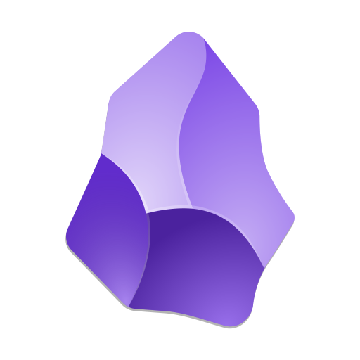

<b>숲을 보며 나무를 심는 개발자</b> 한세영입니다. 
리더로서 <b>전체를 바라보며 방향을 제시</b>하고, 
팔로워로서 <b>단계적으로 작은 조각을 채워가는 과정</b>의 가치를 잘 알고 있습니다.

작은 칸을 채워 큰 그림을 완성하는 <b>퍼즐처럼</b>, 
세부와 전체를 아우르며 <b>잘 만들고 잘 쓰이는 서비스</b>를 책임지겠습니다.

 
 

## Why I Record  
기록하며 성장해왔습니다 
**회고로 과거를 배우고, 현재를 해결하며, 미래를 준비하겠습니다.**  

 

 

  
## What I Used in Development

| Backend | Data & AI | Databases | DevOps & Infra | Tools |
|---|---|---|---|---|
|     |     |           |              |     |
| 프로젝트 백엔드 개발   REST API 설계·구현 | AI 챗봇 서버(OpenAI, RAG)  데이터 정제 및 분석 | SQL/NoSQL 활용  캐싱·실시간 처리·메시징 | 클라우드 기반 배포(AWS)   CI/CD, 데이터 파이프라인 구축 | Git 협업   이슈·태스크 관리 |

 
 

---

## Projects
| 프로젝트명 | 설명 | 기간 | 성과 | 관련기관 |  |  |
|:----------:|:---------------------------:|:-------------------:|:----:|:--------:|:------:|:--------:|
| **U:Near**  (팀프로젝트)     | 오프라인 매장과 사용자 간  연결을 돕는 참여형 혜택 플랫폼 | 25.07.01   ~ 25.08.12 | 최우수상 | LGU+ 유레카 |  |  |
| **Archi**  (팀프로젝트)     | AI 챗봇을 활용한  구독 성향 맞춤 추천 플랫폼 | 25.06.02   ~ 25.06.24 | 우수상 | LGU+ 유레카 |  |  |
| Planvel (팀프로젝트)    | 여행 계획 생성 서비스 | 25.05.05  ~ 25.05.16 | 팀 리딩 및 프로젝트 관리 | LGU+ 유레카 |  |  |
| Talk-o   (개인/스터디)   | 실시간 채팅 기반 스터디 플랫폼 | 25.04.01  ~ 25.04.29 | 스터디 운영 및 기술 세미나 진행 | 개인 |  |  |
| Gatheria  (개인/멘토링)  | 교육 활동 지원 프로젝트 플랫폼 | 25.01  ~ 25.04 | OOP/클린 코드  설계 역량 강화 | F-Lab |  |  |
| 드론제어  (개인/연구)   | DEVS 기반의 재구성 가능한  무인체계 제어 시스템 | 22.07  ~ 22.12 | 국내/국제 학술대회 발표 | 한밭대학교 | - |  |
| PyrexiaSim  (용역/연구/개발) | 디지털 트윈 기반의  산업 안전 빅데이터 플랫폼 | 22.08  ~ 22.11 | 후속 과제 수주 | 한밭대학교, ETRI |  |  |
| TEAMate  (팀프로젝트)   | 채팅 데이터 기반  팀 프로젝트 참여도 분석 시스템 | 21.02  ~ 21.12 | 작품전시회 금상 | 한밭대학교 |  |  |

## Research & Paper

<table>
  <thead>
    <tr>
      <th>년도</th>
      <th>구분</th>
      <th>기관/학회</th>
      <th>제목</th>
      <th></th>
    </tr>
  </thead>
  <tbody>
    <!-- 2023 -->
    <tr>
      <td rowspan="6" align="center">2023</td>
      <td align="center">석사논문</td>
      <td align="center">한밭대학교</td>
      <td>이산사건모델 기반 재구성이 가능한 시스템 구축 방법론:  인공지능 솔루션을 중심으로</td>
      <td align="center">-</td>
    </tr>
    <tr>
      <td align="center">국내학술대회</td>
      <td align="center">[해군과학기술학회]  2023 동계학술대회</td>
      <td>이산사건모델 기반 재구성이 가능한  워게임 시뮬레이션의 분산 실행 관리 시스템</td>
      <td align="center"></td>
    </tr>
    <tr>
      <td align="center">국내학술대회</td>
      <td align="center">[한국시뮬레이션학회] 2023 추계학술대회</td>
      <td>이산사건시스템 형식론 모델 기반의 인공지능 솔루션</td>
      <td align="center"></td>
    </tr>
    <tr>
      <td align="center">국내학술대회</td>
      <td align="center">[한국전기전자학회]  2023 하계학술대회</td>
      <td>이산사건시스템 기반 다중 인공지능 모델 평가 프레임워크</td>
      <td align="center"></td>
    </tr>
    <tr>
      <td align="center">국내학술대회</td>
      <td align="center">[한국시뮬레이션학회] 2023 춘계학술대회</td>
      <td>효과적인 인공지능 학습데이터 획득을 위한 모델기반 데이터 증강 방법</td>
      <td align="center"></td>
    </tr>
    <tr>
      <td align="center">국내저널</td>
      <td align="center">[한국시뮬레이션학회 논문지]  2023년 6월호</td>
      <td>이산사건시스템 기반의 쾌속 디지털 트윈 프로토타입 개발 방법론</td>
      <td align="center"><a href="https://drive.google.com/file/d/1ZQGesFU3j4ZcWG3s_M4L1HqZHobMmuWr/view?usp=sharing">
    </tr>
    <!-- 2022 -->
    <tr>
      <td rowspan="5" align="center">2022</td>
      <td align="center">국제학술대회</td>
      <td align="center">2022 WSC</td>
      <td>Model Based Reconfigurable Unmanned System  Using Discrete Event System Formalism</td>
      <td align="center"></td>
    </tr>
    <tr>
      <td align="center">국내학술대회</td>
      <td align="center">[한국시뮬레이션학회]  2022 추계학술대회</td>
      <td>이산사건시스템 기반 디지털 트윈 아키텍처 설계 및 구현</td>
      <td align="center"></td>
    </tr>
    <tr>
      <td align="center">국내학술대회</td>
      <td align="center">[한국전기전자학회]  2022 하계학술대회</td>
      <td>이산사건시스템 형식론 기반의 시뮬레이션 엔진을 활용한  무인체계 제어 시스템</td>
      <td align="center"></td>
    </tr>
    <tr>
      <td align="center">국내학술대회</td>
      <td align="center">[한국시뮬레이션학회]  2022 춘계 온라인 학술대회</td>
      <td>이산사건시스템 형식론 기반 애플리케이션 개발 방법론</td>
      <td align="center"></td>
    </tr>
    <tr>
      <td align="center">국내저널</td>
      <td align="center">[한국공학교육학회 논문지] 제25권 3호</td>
      <td>비대면 팀 프로젝트 기반 수업 평가를 위한 분석 방법 및 평가환경</td>
      <td align="center">
      </td>
    </tr>
    <!-- 2021 -->
    <tr>
      <td rowspan="1" align="center">2021</td>
      <td align="center">국내학술대회</td>
      <td align="center">[한국공학교육학회]  2021 공학교육학술대회</td>
      <td>팀 프로젝트 학습의 효율적인 운영을 위한 데이터 획득 플랫폼</td>
      <td align="center"></td>
    </tr>
  </tbody>
</table>

## Awards

<table>
  <thead>
    <tr>
      <th>연도</th>
      <th>기관</th>
      <th>대회명</th>
      <th>수상명</th>
      <th>발표/작품명</th>
    </tr>
  </thead>
  <tbody>
    <!-- 2025 -->
    <tr>
      <td align="center" rowspan="2">2025</td>
      <td align="center">LGU+ 유레카</td>
      <td align="center">최종융합프로젝트 경진대회</td>
      <td align="center">최우수상</td>
      <td align="center">통신사 멤버십 제휴처 안내 지도 서비스 (U:Near)</td>
    </tr>
    <tr>
      <td align="center">LGU+ 유레카</td>
      <td align="center">종합프로젝트 경진대회</td>
      <td align="center">우수상</td>
      <td align="center">통신성향 파악 및 상품 비교추천 서비스 (Archi)</td>
    </tr>
    <!-- 2024 -->
    <tr>
      <td align="center">2024</td>
      <td align="center">한밭대학교</td>
      <td align="center">-</td>
      <td align="center">학업우수상</td>
      <td align="center">-</td>
    </tr>
    <!-- 2023 -->
    <tr>
      <td align="center" rowspan="2">2023</td>
      <td align="center">한국시뮬레이션학회</td>
      <td align="center">추계학술대회</td>
      <td align="center">우수논문발표상</td>
      <td align="center">이산사건시스템 형식론 기반 인공지능 솔루션</td>
    </tr>
    <tr>
      <td align="center">한국시뮬레이션학회</td>
      <td align="center">춘계학술대회</td>
      <td align="center">우수논문발표상</td>
      <td align="center">효과적인 인공지능 학습데이터 증강 방법</td>
    </tr>
    <!-- 2022 -->
    <tr>
      <td align="center" rowspan="3">2022</td>
      <td align="center">한국시뮬레이션학회</td>
      <td align="center">추계학술대회</td>
      <td align="center">우수논문발표상</td>
      <td>이산사건시스템 기반 디지털 트윈 아키텍처 설계 및 구현</td>
    </tr>
    <tr>
      <td align="center">나눔과 기술</td>
      <td align="center">제14회 창의설계 경진대회</td>
      <td align="center">금상</td>
      <td align="center">-</td>
    </tr>
    <tr>
      <td align="center">한국시뮬레이션학회</td>
      <td align="center">춘계학술대회</td>
      <td align="center">우수논문발표상</td>
      <td align="center">이산사건 시스템 형식론 기반 앱 개발 방법론</td>
    </tr>
    <!-- 2021 -->
    <tr>
      <td align="center">2021</td>
      <td align="center">한밭대학교</td>
      <td align="center">제10회 작품전시회</td>
      <td align="center">금상</td>
      <td align="center">채팅 데이터 기반 팀 프로젝트 참여도 분석 시스템 (TEAMate)</td>
    </tr>
  </tbody>
</table>

## Experience
| 항목명 | 기간 | 직무 | 업무 | 관련 링크 |
|--------|------|------|------|-----------|
| 한국생산기술연구원 산업융합엔지니어링혁신센터 | 21.12 ~ 22.02 (3개월) | 연구별정(단) | - | [링크](https://) |
| 한밭대학교 SYSAI LAB | 21.06 ~ 24.02 (2년 8개월) | 학부/석사연구생 | - | [링크](https://) |

## Education
| 학교 | 학위 | 기간 | 졸업 과제 |
|------|------|------|-----------|
| 한밭대학교 컴퓨터공학과 | 석사 | 22.03 ~ 24.02 | 이산 사건 모델 기반의 재구성 가능한 시스템 구축 방법론:  인공지능 솔루션을 중심으로 |
| 한밭대학교 컴퓨터공학과 | 학사 |17.03 ~ 22.02 | 채팅 데이터 기반의 팀 프로젝트 참여도 분석 시스템 |

## Bootcamp
| 항목명 | 기간 | 관련 링크 |
|--------|------|-----------|
| LGU+ 유레카 비대면 백엔드 2기 | 25.01 ~ 25.08(8개월) | - |
| F-Lab 자바 백엔드 과정 | 24.12 ~ 25.04(5개월) | - |
| 항해99 취업 리부트 코스 4기 | 24.07 ~ 24.09(3개월) | - |

## Extracurricular Activities
| 항목명 | 기간 | 관련 링크 |
|--------|------|-----------|
| 활동명 | YYYY.MM ~ YYYY.MM | [링크](https://) |
